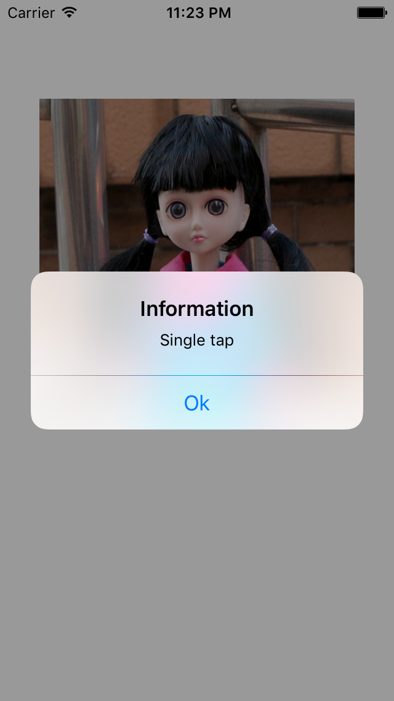

### sumup key points
* usages of UIImage
* usages of UIImageView
* creating border for UIImageView
* scale UIImage to fit screen
* make round corner effect
* make shadow effect
* basic usage of CAGradientLayer
* make gradient effect
* basic usage of UIColor.init
* fill background color with pattern image
* use CGAffineTransformRotate to rotate the UIView

**new:**
> * basic concepts of UITapGestureRecognize
> * how UIView (or its subclasses) interacts with UITapGestureRecognize
> * basic usage of UIAlertController
> * how to add action to UIAlertController
> * how to present a UIAlertController

---

