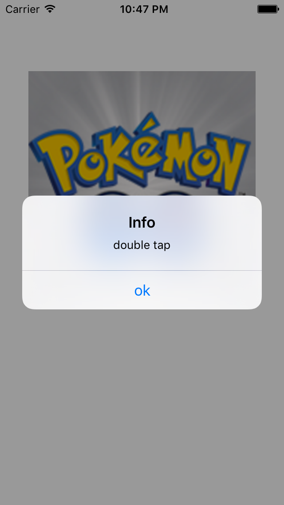

# handle double tap

## Key ponits
- CGRectMake
- UIImageView
- UIImage
- userInteractionEnabled
- addSubview
- UILongPressGestureRecognizer
- addGestureRecognizer
- UITapGestureRecognizer
- numberOfTapsRequired
- numberOfTouchesRequired
- UIAlertController
- UIAlertAction
- addAction
- presentViewController

## Result

