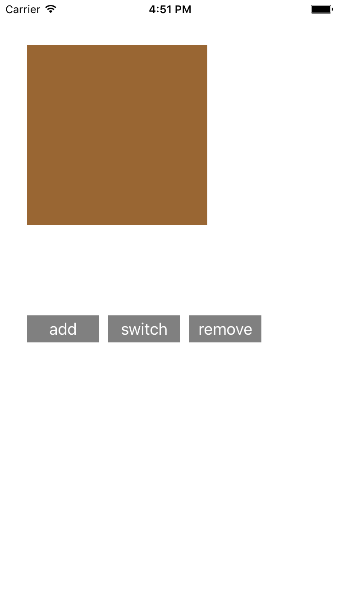
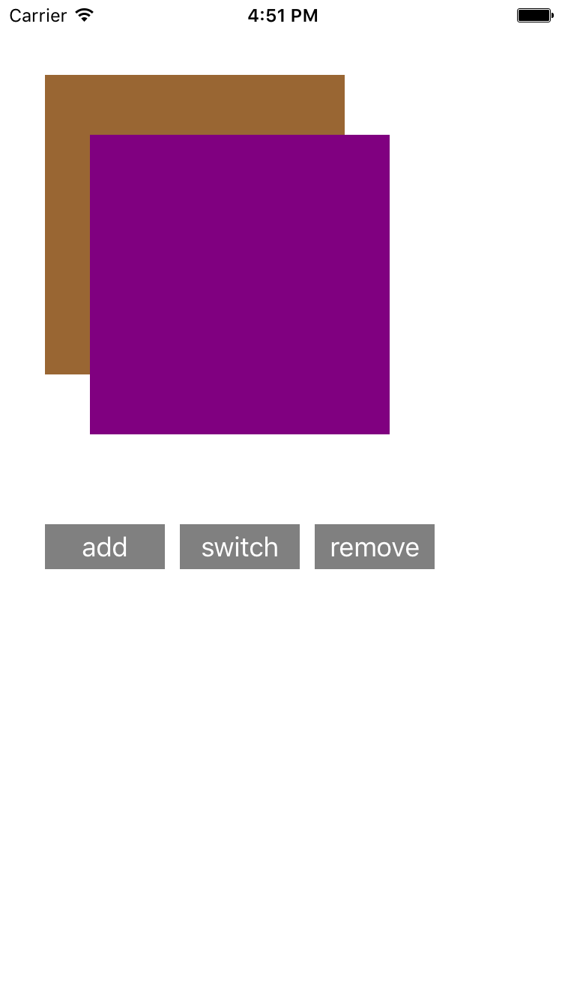
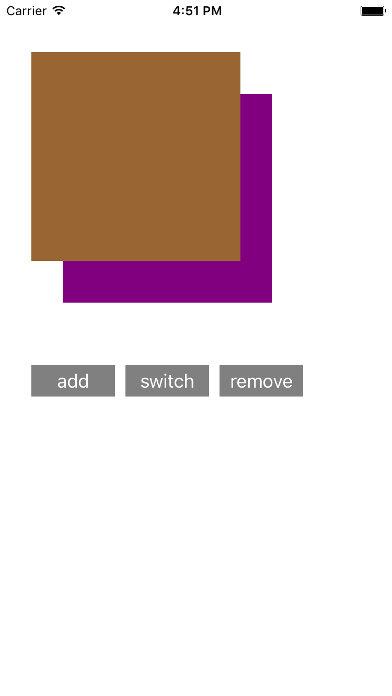

# Add/Delete/Z-order Rects

## key points
- viewDidLoad
- CGRectMake
- UIView
- backgroundColor
- UIColor
- addSubview
- UIButton
- setTitle
- addTarget
- viewWithTag
- sendSubviewToBack
- removeFromSuperview

---

### app starts

---

### tapped add button

---

### tapped switch button

---

### tapped remove button

