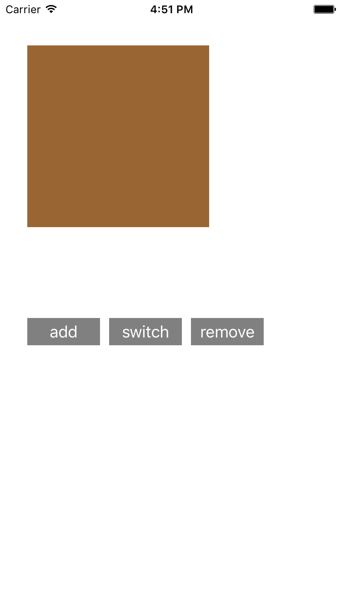

### demo points
1. basic usages of *UIButton*
2. adding *UIButton* by code
3. basic usages of **tag** property of UIView
4. adding/removing UIViews by code

---

### app starts

---

### tapped add button

---

### tapped switch button

---

### tapped remove button

