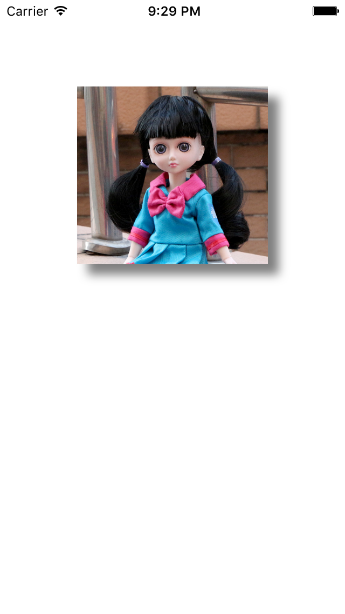

# Image with shadow

## key points
- UIImage
- UIImageView
- CGRectMake
- contentMode
- layer.shadowColor
- UIColor.blackColor().CGColor
- layer.shadowOffset
- CGSizeMake
- layer.shadowRadius
- layer.shadowOpacity
- addSubview

## result

