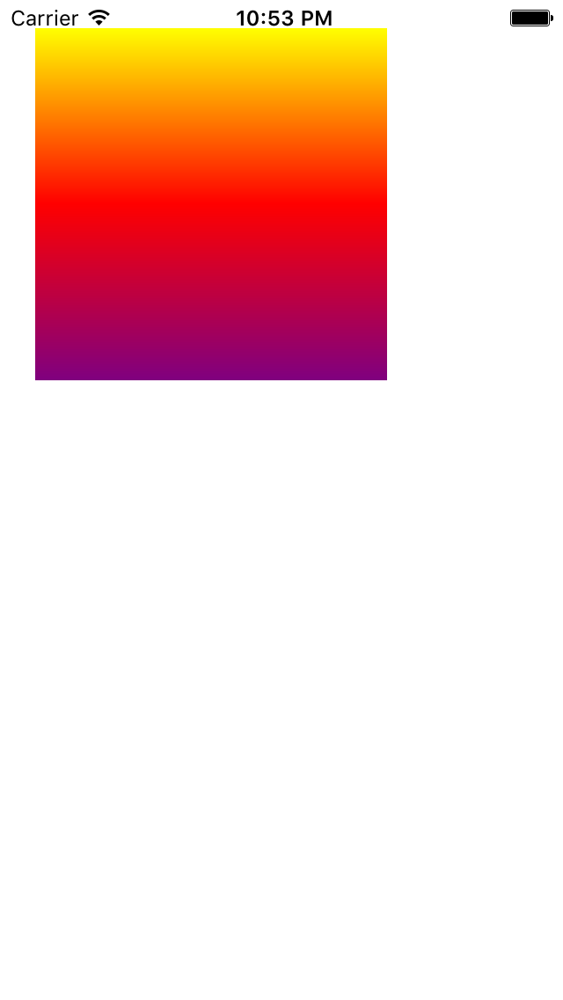

### sumup key points
* usages of UIImage
* usages of UIImageView
* creating border for UIImageView
* scale UIImage to fit screen
* make round corner effect
* make shadow effect

**new:**
> * basic usage of CAGradientLayer
> * make gradient effect

---

