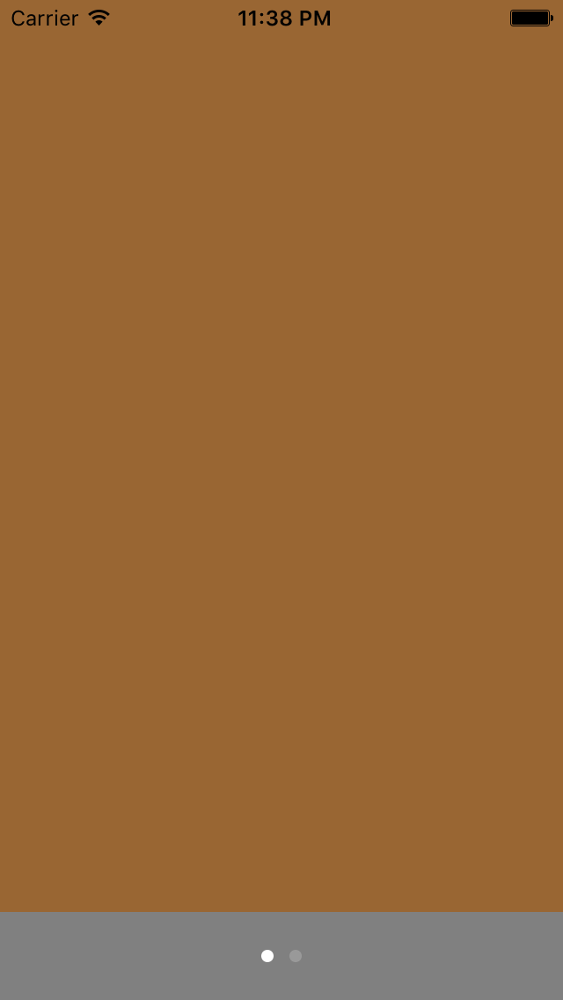
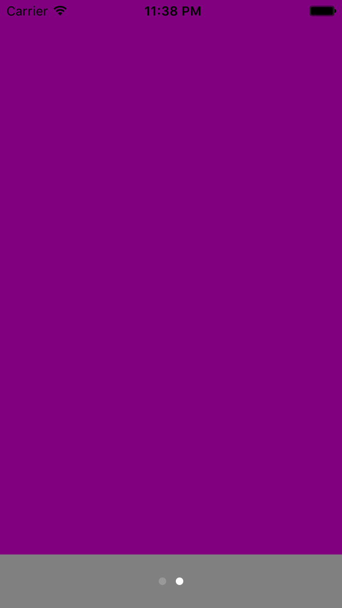

# ScrollView & PageControl

## key points
- UIScrollView
- UIPageControl
- UIScreen.mainScreen().bounds
- size.width
- size.height
- pagingEnabled
- CGSizeMake
- UIColor
- contentSize
- backgroundColor
- delegate
- CGRectMake
- numberOfPages
- currentPage
- addTarget
- origin.x
- addSubview
- origin.y
- scrollRectToVisible
- scrollViewDidScroll
- frame.size.width
- scrollViewWillBeginDecelerating

## result

