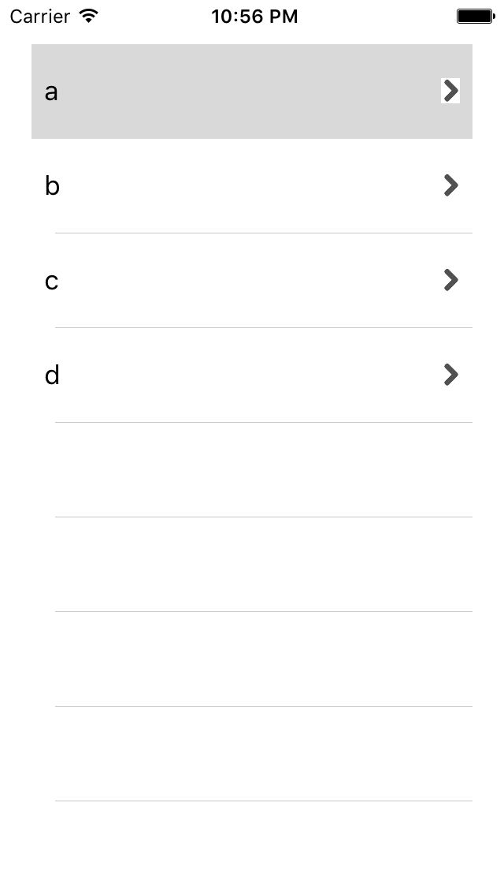

# Use storyboard 4

## To
- display table items with label & image
- add UITableViewDataSource
- add UITableViewDelegate
- (code) implement tableView(tableView: UITableView, numberOfRowsInSection section: Int) -> Int
- (code) implement tableView(tableView: UITableView, cellForRowAtIndexPath indexPath: NSIndexPath) -> UITableViewCell
- (code) tableView.dequeueReusableCellWithIdentifier
- (code) cell?.viewWithTag(1) as! UILabel

## Result

