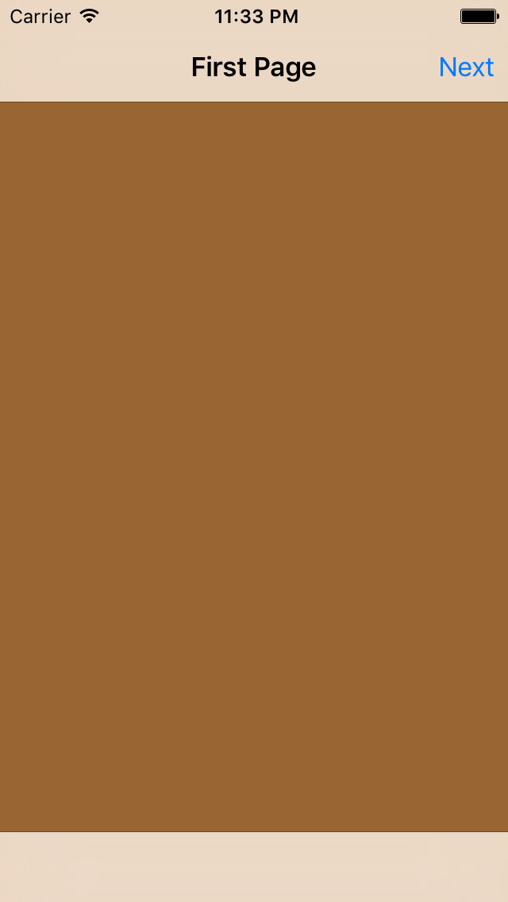
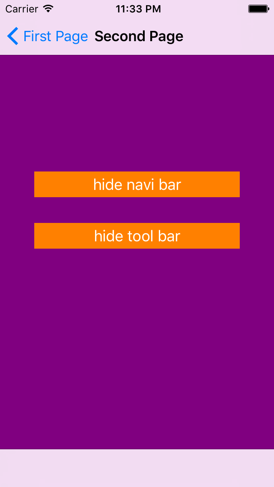
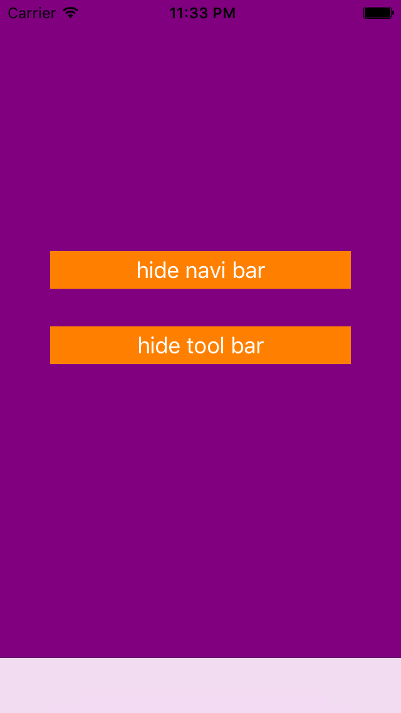
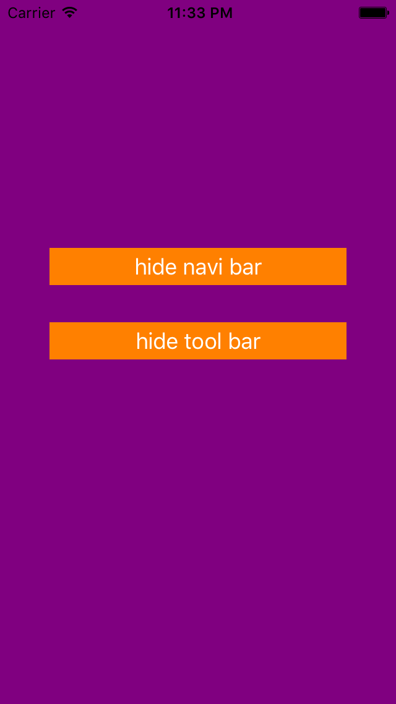

# UINavigationController 2

## key points
- title
- backgroundColor
- navigationItem.rightBarButtonItem
- UIBarButtonItem
- navigationController?.pushViewController
- UINavigationController
- window?.rootViewController
- viewWillAppear
- navigationController?.setToolbarHidden
- UIButton
- setTitle
- addTarget
- navigationController?.setNavigationBarHidden
- navigationController?.setToolbarHidden

## result

