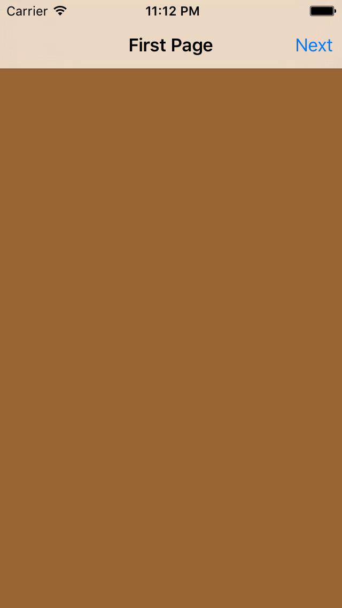

# UINavigationController 3 push/pop views

## key points
- title
- backgroundColor
- navigationItem.rightBarButtonItem
- UIBarButtonItem
- navigationController?.pushViewController
- UINavigationController
- window?.rootViewController
- addTarget
- navigationController?.popViewControllerAnimated
- navigationController?.popToViewController
- navigationController?.popToRootViewControllerAnimated

## result

