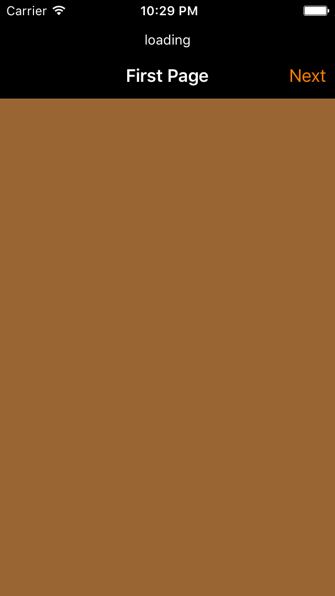

# UINavigationController 4 navigationBar customizations

## key points
- title
- backgroundColor
- navigationItem.rightBarButtonItem
- UIBarButtonItem
- navigationController?.pushViewController
- UINavigationController
- window?.rootViewController
- addTarget
- navigationController?.popViewControllerAnimated
- navigationController?.popToViewController
- navigationController?.popToRootViewControllerAnimated
- viewWillAppear
- navigationItem.prompt
- navigationController?.navigationBar.translucent
- navigationController?.navigationBar.barStyle
- navigationController?.navigationBar.tintColor

## result

