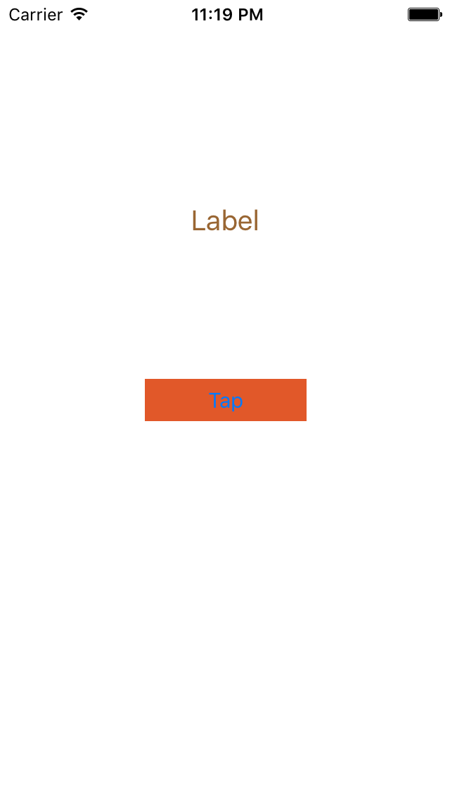
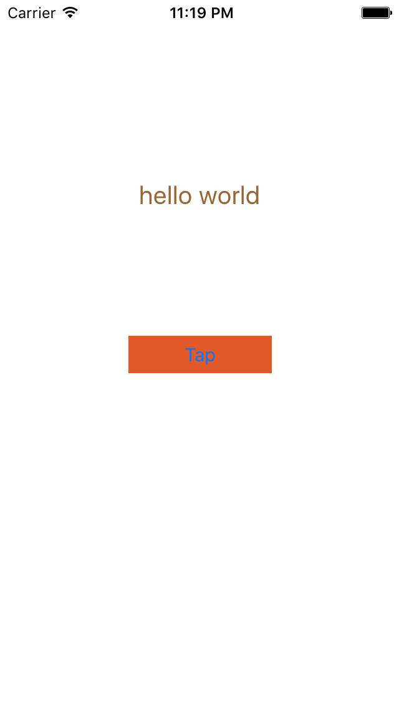

# Using Storyboard

## To
- fix screen size
- add labels
- change the size of labels
- change text alignment of labels
- change font size of labels
- add buttons
- change bottons' background color
- connect labels/buttons to swift code
- add IBAction for button
- add IBOutlet for label

## Result

